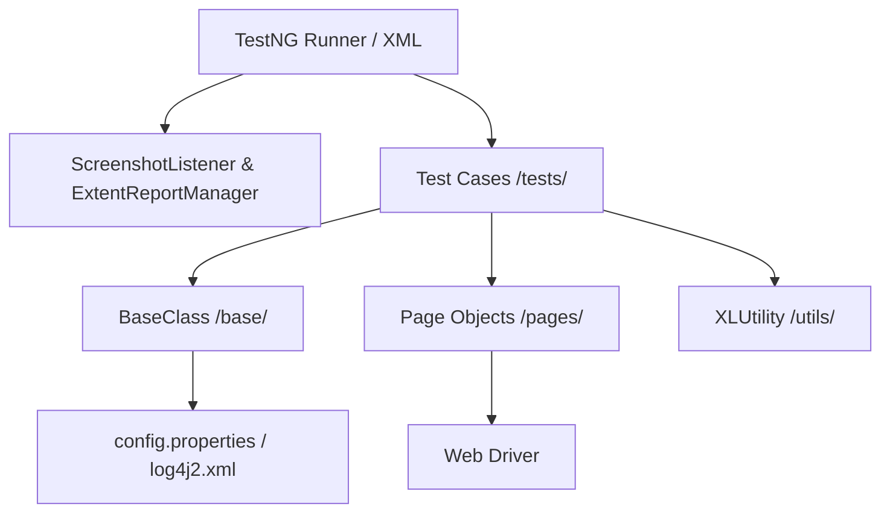

# 🚀 Premium E-Commerce Test Automation Framework

[](https://www.oracle.com/java/)
[](https://www.selenium.dev/)
[](https://testng.org/)
[](https://www.extentreports.com/)
[](https://maven.apache.org/)

A professional, interview-ready, high-performance hybrid test automation framework designed using the **Page Object Model (POM)** and **Page Factory** design patterns. This repository features robust session handling, modular logic, automatic screenshot captures on failure, and premium custom reporting.

---

## 🌟 Key Features

*   **Curated Core Scenarios:** Focuses on the most high-impact e-commerce workflows (8 key end-to-end tests).
*   **Automatic Failure Screenshots:** Integrated with custom TestNG listener `ScreenshotListener` to capture browser viewports automatically upon test failure.
*   **Unified Reporting Hub:** Uses `Extent Reports 5` (Dark Theme) to gather detailed operational steps, logs, categories, and embedded screenshots of failures.
*   **Cross-Browser Capability:** Seamlessly configure and execute tests concurrently on Chrome, Edge, and Firefox.
*   **Log4j2 Logger:** Comprehensive step-by-step console and file logging mapped per lifecycle.

---

## 🛠️ Tech Stack & Architecture



*   **Core Logic:** Java 11+, Selenium WebDriver (v4.0.0-beta-2)
*   **Test Runner:** TestNG
*   **Design Pattern:** Page Object Model with Page Factory Elements initialization
*   **Build Automation:** Maven
*   **Utilities:** Apache POI (Excel Data-Driven capability), Commons IO, WebDriverManager

---

## 📂 Professional Directory Layout

```
src/test/java/
├── base/
│   └── BaseClass.java          # Global browser launch, teardown, config setups, and screen capture utils.
├── pages/
│   ├── HomePage.java           # Top navigation, account actions
│   ├── LoginPage.java          # Authentication and Forgot Password actions
│   ├── RegistrationPage.java   # Account sign-up fields
│   ├── SearchPage.java         # Global product search results
│   ├── ProductPage.java        # Product details, reviews, and wishlist interactions
│   ├── CartPage.java           # Shopping cart list, coupon operations
│   ├── CheckoutPage.java       # Checkout summary and verification
│   └── AccountPage.java        # Order histories, site-maps, and logouts
├── tests/
│   ├── RegistrationTest.java   # Customer sign-up workflows
│   ├── LoginTest.java          # Mandatory credentials check
│   ├── SearchTest.java         # Searching catalog items
│   ├── AddToCartTest.java      # Cart addition verification
│   ├── CheckoutTest.java       # End-to-end purchasing workflow
│   ├── WishlistTest.java       # Adding items to favorites
│   ├── ForgotPasswordTest.java # Validation of account recovery links
│   └── LogoutTest.java         # Session cleanup and termination
├── utils/
│   └── XLUtility.java          # Excel read/write data helpers
└── listeners/
    ├── ExtentReportManager.java# Beautiful real-time interactive reports
    └── ScreenshotListener.java # Custom automated failure capture listener
```

---

## 🚀 Getting Started

### 📋 Prerequisites

1.  **Java Development Kit (JDK 11 or higher)**
2.  **Apache Maven**
3.  **Google Chrome, Microsoft Edge, or Mozilla Firefox**

### 💻 Running Tests

To run all 8 core test cases concurrently using the default browser suite (Chrome):

```bash
mvn clean test -DsuiteXmlFile=alltests.xml
```

To run individual tests or custom login suites:

```bash
mvn test -DsuiteXmlFile=mytestng.xml
```

---

## 📸 Automated Test Reports & Failure Handling

### Real-Time Extent Reports
All reports are generated inside the `reports/` folder. With a single double-click on the `.html` file, you can view the fully responsive dark-themed execution logs, execution timestamps, skipped tests, and categories.

### Screenshot-on-Failure
Whenever a test fails, `ScreenshotListener` automatically invokes the Selenium screenshot method. It saves the screenshot file locally to `screenshots/{testMethodName}.png` and embeds it directly into the Extent Report:

```java
// Example failure handling in listener
public void onTestFailure(ITestResult result) {
    WebDriver driver = ((BaseClass) result.getInstance()).driver;
    captureScreen(driver, result.getName());
}
```

---
*Developed as a premium showcase of Software Development Engineer in Test (SDET) best practices.*
